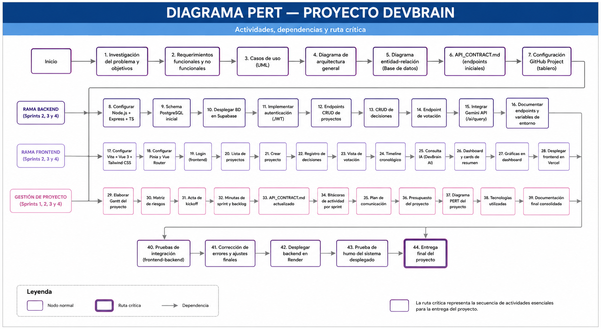

# Diagrama PERT del proyecto

## Descripción

El siguiente diagrama PERT representa las actividades principales desarrolladas durante los cuatro sprints del proyecto DevBrain, mostrando las dependencias entre tareas, las estimaciones de tiempo y la ruta crítica del proyecto.

## Diagrama

## Actividades consideradas

- Configuración inicial del proyecto (Setup).
- Desarrollo del backend base.
- Desarrollo del frontend base.
- Implementación del módulo de decisiones.
- Integración de inteligencia artificial (Gemini API).
- Despliegue del sistema.

## Ruta crítica

La ruta crítica identifica la secuencia de actividades que determinó la duración total del proyecto, considerando las dependencias entre los módulos principales.