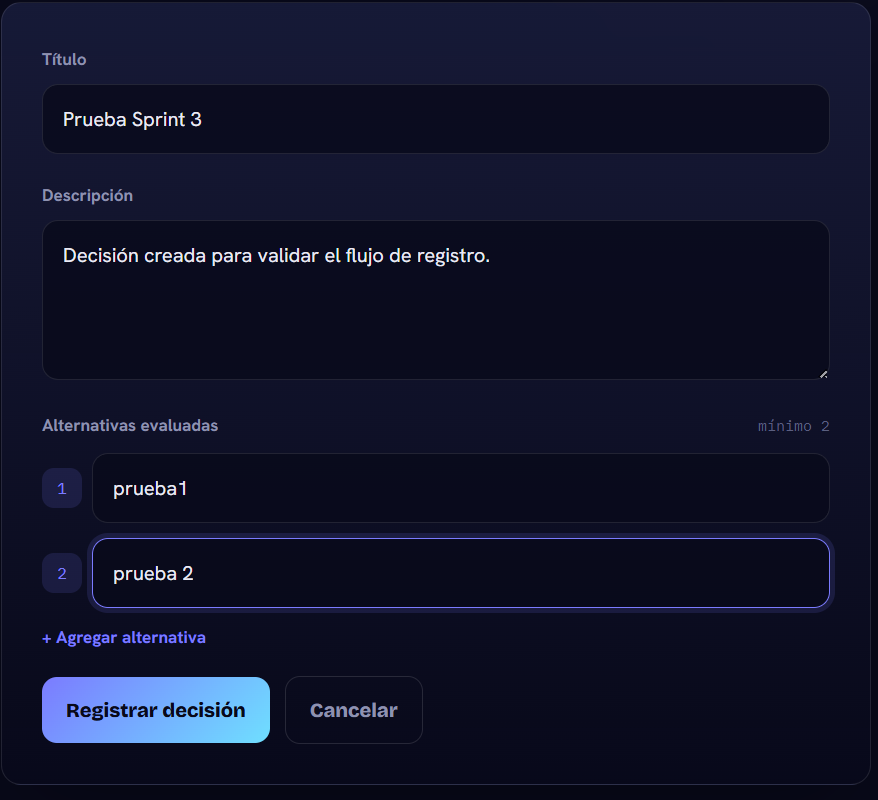
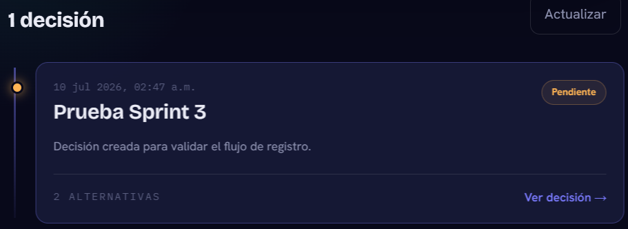
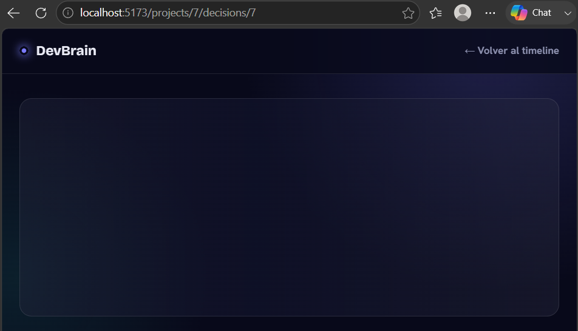
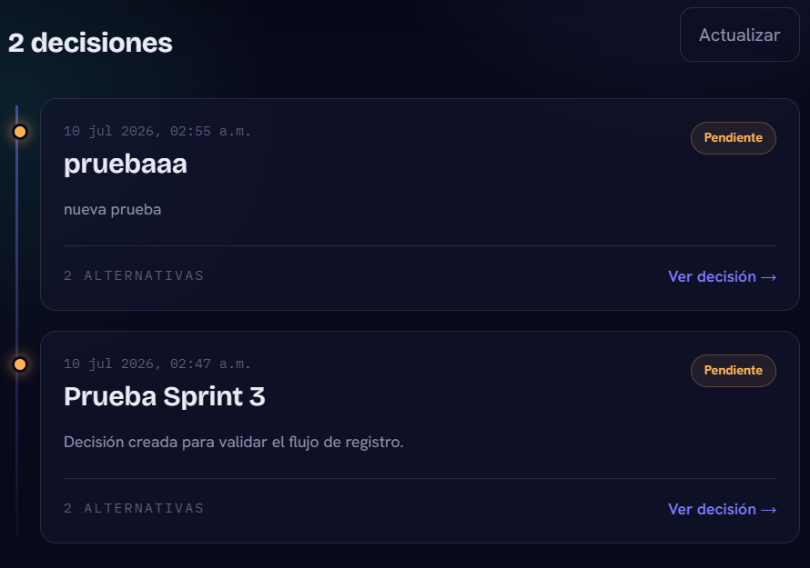

# Pruebas Sprint 3 - Módulo de Decisiones

## Información de prueba

**Módulo probado:** Decisiones  
**Sprint:** 3  
**Fecha:**  
**Responsable:**  

---

# Checklist de pruebas

## 1. Crear decisión

**Objetivo:** Validar que un usuario pueda registrar una nueva decisión dentro de un proyecto.

### Pasos:
1. Ingresar al sistema.
2. Seleccionar un proyecto.
3. Acceder al módulo de decisiones.
4. Crear una nueva decisión.
5. Completar título y descripción.
6. Guardar.

### Resultado esperado:
La decisión debe guardarse correctamente y aparecer en el listado.

### Resultado obtenido:
✅ Correcto

---

## 2. Ver detalle de decisión

**Objetivo:** Validar la consulta de una decisión existente.

### Pasos:
1. Seleccionar una decisión creada.
2. Abrir el detalle.

### Resultado esperado:
Se debe mostrar:
- Título.
- Descripción.
- Información relacionada.
- Opciones disponibles.

### Resultado obtenido:
❌ Falló

No carga el apartado
---

## 3. Votar decisión

**Objetivo:** Validar que un usuario pueda emitir un voto.

### Pasos:
1. Abrir una decisión.
2. Seleccionar una opción de votación.
3. Confirmar voto.

### Resultado esperado:
El voto debe registrarse y actualizarse el conteo.

### Resultado obtenido:
❌ Falló

---

## 4. Votación duplicada

**Objetivo:** Validar que un usuario no pueda votar más de una vez.

### Pasos:
1. Abrir una decisión.
2. Realizar un voto.
3. Intentar votar nuevamente.

### Resultado esperado:
El sistema debe bloquear el segundo voto.

### Resultado obtenido:
❌ Falló

---

## 5. Timeline actualizado

**Objetivo:** Validar que las decisiones aparecen en el historial del proyecto.

### Pasos:
1. Crear una decisión.
2. Ir al timeline del proyecto.
3. Revisar los eventos recientes.

### Resultado esperado:
La nueva decisión debe aparecer en el timeline.

### Resultado obtenido:
✅ Correcto

---

---

# Bugs encontrados

## Bug 1

**Título:**   
No se muestran decisiones
**Descripción:**  
NO abre el apartado de decisiones, por lo tanto no es posible continuar con el chequeo

**Pasos para reproducir:**
1. Iniciar sesión en la aplicación con un usuario válido.
2. Acceder al Dashboard de proyectos.
3. Seleccionar un proyecto existente.
4. Intentar ingresar al apartado de decisiones del proyecto.
5. Esperar la carga de la información.
6. Verificar que la pantalla permanece en estado de carga y no muestra las decisiones disponibles.

**Resultado esperado:**
El sistema debe mostrar el listado de decisiones del proyecto, permitiendo consultar detalles y realizar votaciones.

**Resultado obtenido:**
La vista de decisiones queda cargando indefinidamente y no permite acceder al contenido ni continuar con las pruebas de votación.

**Evidencia:**

**Estado:**
- Pendiente
